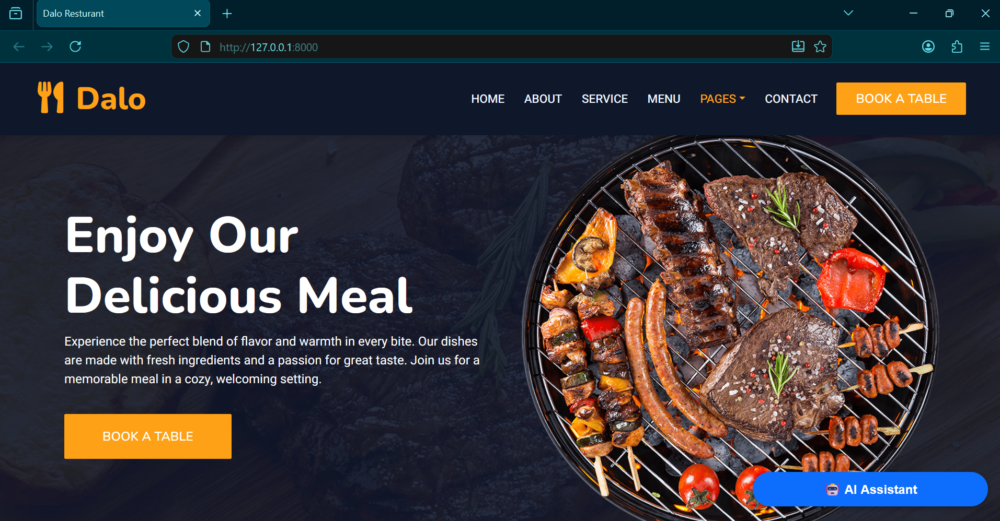
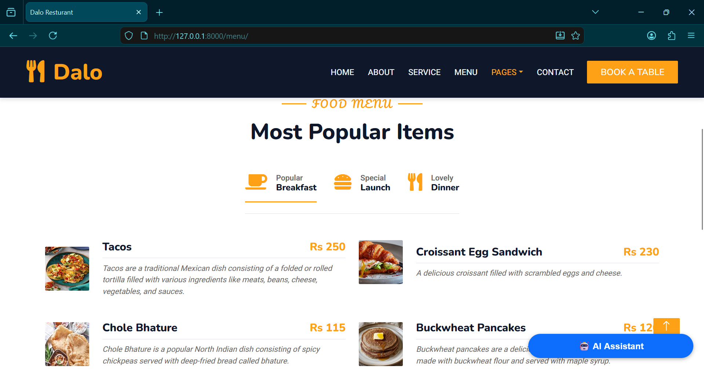
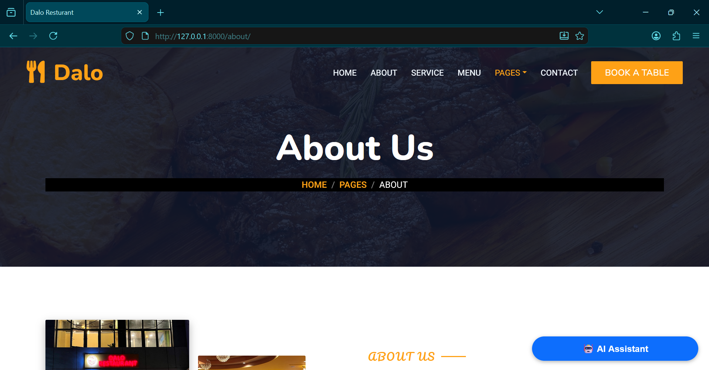
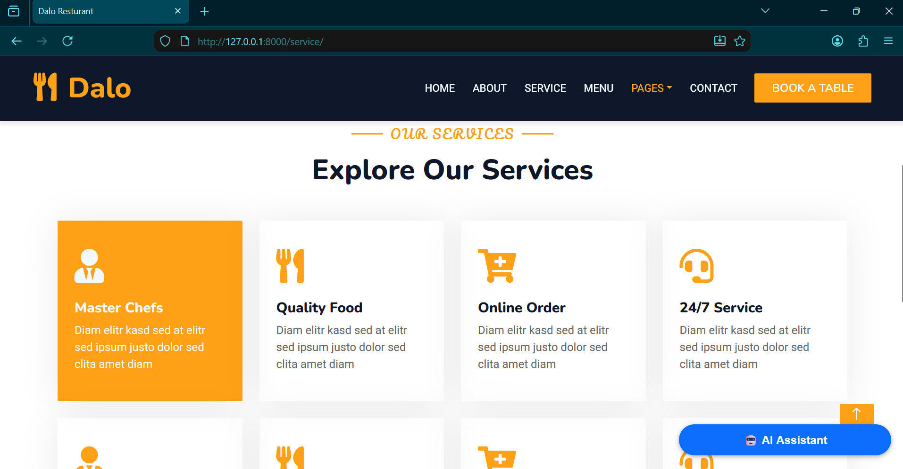
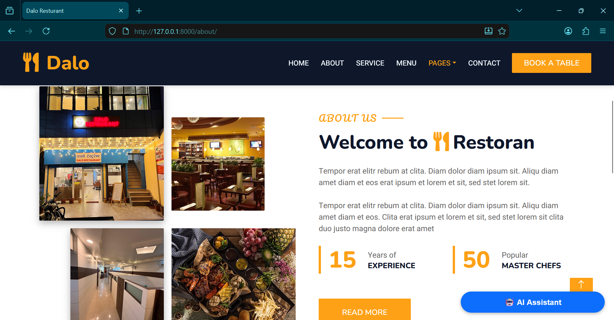

# Restaurant Django Website 🍽️

This is a restaurant website built using Django. It allows users to view menu items, learn about the restaurant, and book tables online.

## 🚀 Project Overview

This project is created as a learning-based Django project. It contains multiple pages such as Home, Menu, About, Booking, and Contact.

## 🛠️ Technologies Used

- Python
- Django
- HTML
- CSS
- JavaScript

## ✨ Features

- Home page with restaurant details
- Menu page displaying food items
- About us page
- Table booking system
- Contact page

## 📸 Screenshots
**Home paga**

**Menu Page**

**Reservation Page**

**AboutUs Page**

**Service Page**

**About Page**

**Contact Page**

